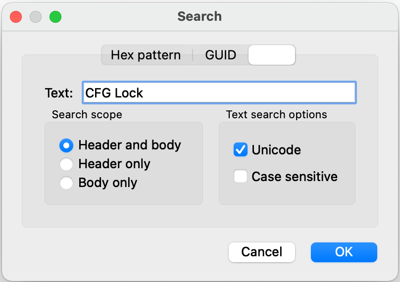
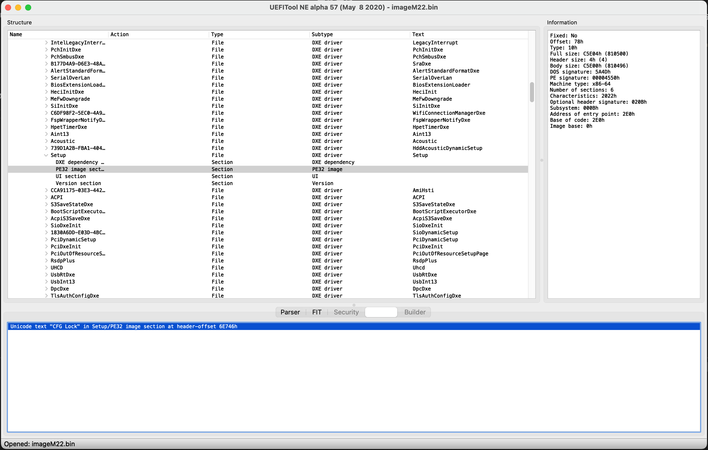

# 解锁 CFGLock
## 1. 开始
此机型有以下两个问题：

1. BIOS 中隐藏了 CFGLock 相关选项；
2. CFGLock.efi 无法自动解锁。

因此只有两个选择了：

1. 使用 OpenCore config.plist 中 Kernel 相关 patch
2. 手动修改 UEFI Vars

根据 OpenCore 官方文档，方法二是最佳选择。

## 2. 过程

### 2.1 下载/更新 BIOS

在联想官方网站上面找到 BIOS，选择版本后下载。记得找和你 BIOS 版本一致的文件，或者干脆找想要的版本后更新 BIOS。
进行下一步前要保证自己机器的 BIOS 和操作的 BIOS 文件版本相同。这里以 `M22JY42USA` 版本为例。

联想官网下载的 BIOS 升级程序是 EXE 的，需要解包，用常用的解压缩软件解压，找到其中的 bin 文件，这里是 `imageM22.bin`。

### 2.2 下载需要的工具

* [UEFITool](https://github.com/LongSoft/UEFITool/releases)
* [Universal-IFR-Extractor](https://github.com/LongSoft/Universal-IFR-Extractor/releases)
* [Modified GRUB Shell](https://github.com/datasone/grub-mod-setup_var/releases)

### 2.3 找到偏移量

用 UEFITool 打开 `imageM22.bin`, 按 `⌘ + F` 打开搜索对话框，选择 `Text` 选项卡，输入 `CFG Lock` 查找。



如图会在 `Setup/PE32` 一节找到这个字符串，在 Setup 上右击，选择 `Extract as is...`，导出这一项。



使用 `ifrextract` 输出为文本文件:

```
./ifrextract File_DXE_driver_Setup_Setup.ffs ./File_DXE_driver_Setup_Setup.txt
```

随后用任意文本编辑器打开导出的 `File_DXE_driver_Setup_Setup.txt`，搜索 `CFG Lock`，找到 CFG Lock 的偏移，如图为 `0x727`.


### 2.4 修改偏移量解锁 CFG Lock

首先把 Modified GRUB Shell 的 efi 文件 `modGRUBShell.efi` 加入 OpenCore 的 Tools 文件夹并在 `config.plist` 中启用，开机后选择这一项运行。

使用以下代码查看 CFG Lock 状态
```
setup_var_3 0x727
```

使用以下代码解锁
```
setup_var_3 0x727 0x00
```

至此解锁完成。

### 2.5 移除 OpenCore config.plist 中的 Kernel 补丁配置

将 `Kernel -> Quirks -> AppleCpuPmCfgLock` 和 `Kernel -> Quirks -> AppleXcpmCfgLock` 两项均设为关闭。

重启。
