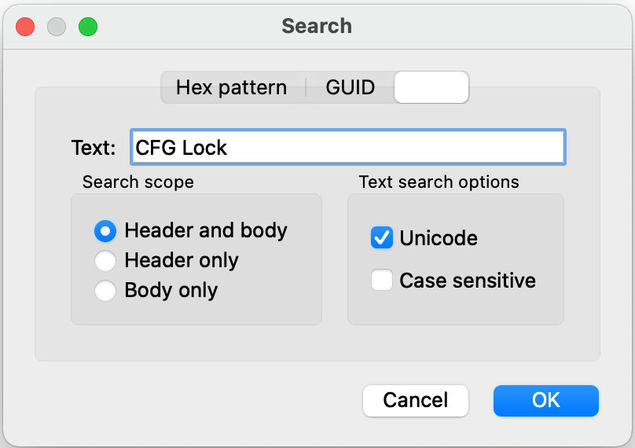
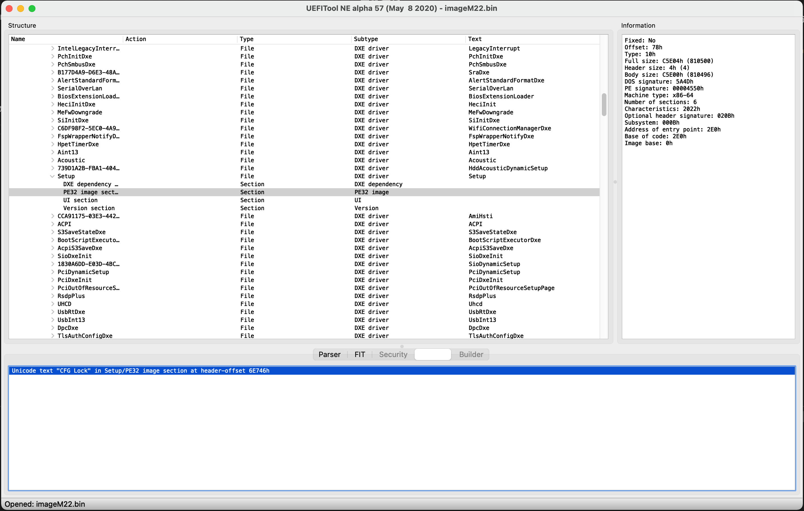

# Unlock CFGLock
## 1. Problems
There are 2 problems：

1. No CFG relate options in BIOS;
2. CFGLock.efi unable to unlock automatically.

So you have only 2 options:

1. Use kernel patches by enabling them in OpenCore config.plist;
2. Modify UEFI Vars manually.

According to OpenCore docs, option 2 is the better choice.

## 2. Methods

### 2.1 Download/Upgrade BIOS

You can find BIOS download link on Lenovo's support site. Find BIOS update matches your current BIOS version or upgrade your BIOS to a downloaded one. 

I use the latest version `M22JY42USA`.

Lenovo's offical BIOS upgrade file is a Windows EXE file, you can use an unarchive app to unpack it, and find the BIOS bin file. For `M22JY42USA`, filename is `imageM22.bin`.

### 2.2 Download tools

* [UEFITool](https://github.com/LongSoft/UEFITool/releases)
* [Universal-IFR-Extractor](https://github.com/LongSoft/Universal-IFR-Extractor/releases)
* [Modified GRUB Shell](https://github.com/datasone/grub-mod-setup_var/releases)

### 2.3 Find offset

Open `imageM22.bin` by UEFITool, press `⌘ + F` to open search dialog, select `Text` tab and search for `CFG Lock`.



You can find this string in `Setup/PE32` section. Right click on `Setup`, click `Extract as is...` to export ffs file.



Then use `ifrextract` to convert ffs to a readable txt file:

```
./ifrextract File_DXE_driver_Setup_Setup.ffs ./File_DXE_driver_Setup_Setup.txt
```

Use your txt editor to open `File_DXE_driver_Setup_Setup.txt`, search for `CFG Lock`, find offset of `CFG Lock`, in this case it's `0x727`.


### 2.4 Unlock CFG Lock

First copy `modGRUBShell.efi` into OpenCore Tools dirtectory and enable it in `config.plist`.
Then restart your hackintosh and select it in OpenCore menu.

Verify CFG Lock var offset and value:
```
setup_var_3 0x727
```

Unlock CFG Lock:
```
setup_var_3 0x727 0x00
```

Now CFG Lock is unlocked.

### 2.5 Disable Kernel Patches in OpenCore config.plist

Disable `Kernel -> Quirks -> AppleCpuPmCfgLock` and `Kernel -> Quirks -> AppleXcpmCfgLock`.

Reboot.
